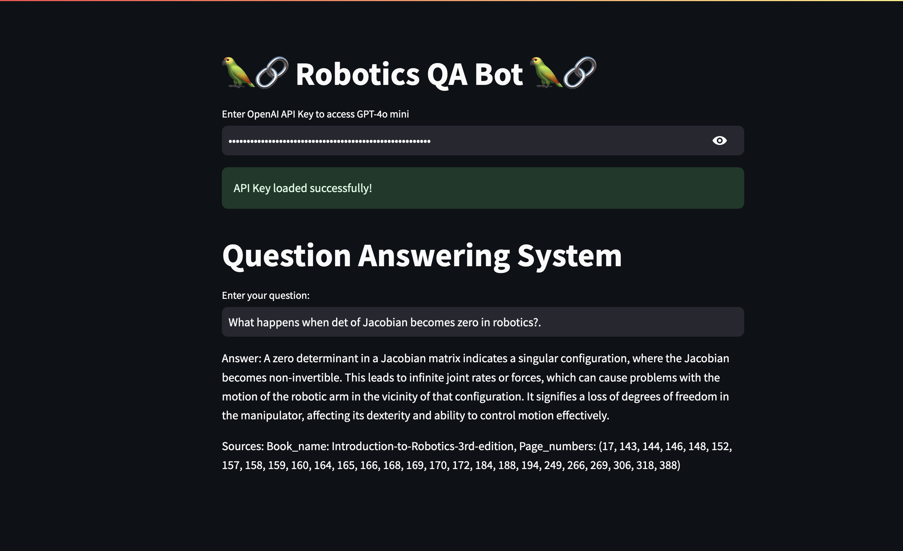

<!-- Improved compatibility of back to top link: See: https://github.com/othneildrew/Best-README-Template/pull/73 -->
<a name="readme-top"></a>
<!--
*** Thanks for checking out the Best-README-Template. If you have a suggestion
*** that would make this better, please fork the repo and create a pull request
*** or simply open an issue with the tag "enhancement".
*** Don't forget to give the project a star!
*** Thanks again! Now go create something AMAZING! :D
-->


<!-- PROJECT SHIELDS -->
<!--
*** I'm using markdown "reference style" links for readability.
*** Reference links are enclosed in brackets [ ] instead of parentheses ( ).
*** See the bottom of this document for the declaration of the reference variables
*** for contributors-url, forks-url, etc. This is an optional, concise syntax you may use.
*** https://www.markdownguide.org/basic-syntax/#reference-style-links
-->
<!--[![Contributors][contributors-shield]][contributors-url]
[![Forks][forks-shield]][forks-url]
[![Stargazers][stars-shield]][stars-url]
[![Issues][issues-shield]][issues-url]
[![MIT License][license-shield]][license-url]
[![LinkedIn][linkedin-shield]][linkedin-url]-->


<!-- PROJECT LOGO -->
<br />
<div align="center">
  

<h3 align="center">Robotics Question Answering LLM App</h3>

  <p align="center">
    This repo includes the source code for the developing a Question answering LLM app using the  OpenAI API,Streamlit and Langchain. The Milvus lite database is used to store the generated RAPTOR index from three robotics textbooks given in the reference section. You can access the app with your own OpenAI API key with this  link to the Stream lit community cloud: 

<video src='video/streamlit-app-2024-07-25-15-07-59.webm' width=180/>
   
  </p>
</div>


<!-- TABLE OF CONTENTS -->
<details>
  <summary>Table of Contents</summary>
  <ol>
    <li>
      <a href="#about-the-project">About The Project</a>
    </li>
    <li>
      <a href="#prerequisites and installation">Prerequisites and Installation</a>
    </li>
    <li><a href="#Using the Streamlit App UI">Steps Involved - Without Argo Rollouts </a></
  
    <li><a href="#license">License</a></li>
    <li><a href="References">References</a></li>
  </ol>
</details>


<!-- ABOUT THE PROJECT -->
## About The Project

In this project, a question answering LLM streamlit chatbot is build from a RAPTOR index Milvus lite vecotr database of a collection of three textbooks related to robotics. The content extraction and chunking process of the textbooks are done using the file `extract_and_chunk_embed.ipynb` and the combined textbook chunks are stored as `Content_extraction_and_chunking_embed/combined_textbook_chunk_metadata.pkl`. Using the saved file, the RAPTOR indexing is done using the code in  `RAPTOR_indexing/raptor-index_final_kaggle.ipynb`.

For the summarization step, `gpt-4o-mini` from OpenAI is used. The hierarchial tree structure is build with 5 depths or levels  and stored as `RAPTOR_indexing/rec_results_full.pkl`. This file is used to build the Milvus lite vector database with SBERT Embeddings (`multi-qa-MiniLM-L6-cos-v1`) and the implement the retrieval and Question answering bot creation in the file `QA-Retrieval-final.ipynb`. For the Hybrid retriever BM25 with the vector store retriever is used. Further FlashRank is used for the reranking and for Query expansion,`gpt-4o-mini` based Stepback prompting is used. More details about Stepback prompting can be found in the reference section. Finally the QA model is build again using `gpt-4o-mini` OpenAI API model. All of the three `.ipynb` files can be run on Goggle Colab or kaggle for faster execution. The streamlit appliction is defined in the file `app.py` and the utils for the applications is defined in the file `QA_utils.py`.

<p align="right">(<a href="#readme-top">back to top</a>)</p>


<!-- GETTING STARTED -->
### Prerequisites and Installation

 For running this application in the Streamlit cloud, in Kaggle notebook or locally you will need an OpenAI API key. For running it locally inside a virtual environment, you can use the below code to install the packages:
 
  ```sh
   pip install -r requirements.txt
  ```


<p align="right">(<a href="#readme-top">back to top</a>)</p>

## Using the Streamlit App UI
* For using the application, you will need to provide a API key from OpenAI. The application uses `gpt-4o-mini` model for the Question answering chain. After the api is provided, you can ask question related to robotics to the application. The answer along with the sources(Book name and pages) are displayed back from the application. After deleting the current question in the textfield, you ask the application more questions.


<p align="right">(<a href="#readme-top">back to top</a>)</p>

<!-- LICENSE -->
## License

Distributed under the MIT License. See `LICENSE.txt` for more information.

<p align="right">(<a href="#readme-top">back to top</a>)</p>


<!-- ACKNOWLEDGMENTS -->
## References

* [Introduction-to-Robotics-3rd-edition](https://www.changjiangcai.com/files/text-books/Introduction-to-Robotics-3rd-edition.pdf)
* [Introduction to Autonomous Mobile Robots book](https://www.ucg.ac.me/skladiste/blog_13268/objava_56689/fajlovi/Introduction%20to%20Autonomous%20Mobile%20Robots%20book.pdf)
* [Mataric-primer(The robotics primer)](https://pages.ucsd.edu/~ehutchins/cogs8/mataric-primer.pdf)
* [Langchain cookbook-RAPTOR](https://github.com/langchain-ai/langchain/blob/master/cookbook/RAPTOR.ipynb)
* [Stepback Prompting](https://arxiv.org/abs/2310.06117)

<p align="right">(<a href="#readme-top">back to top</a>)</p>


<!-- MARKDOWN LINKS & IMAGES -->
<!-- https://www.markdownguide.org/basic-syntax/#reference-style-links -->

[license-shield]: https://img.shields.io/github/license/DOOMNOVA/A_p_test.svg?style=for-the-badge
[license-url]: https://github.com/DOOMNOVA/A_p_test/blob/master/LICENSE.txt


